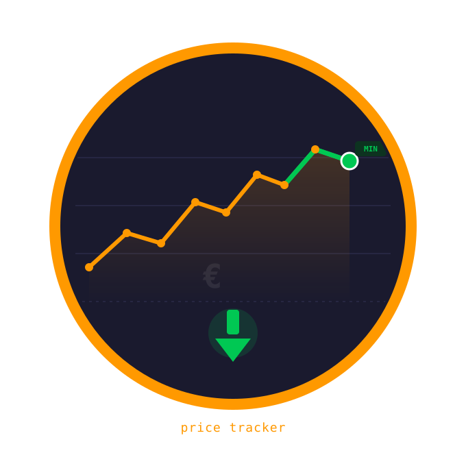
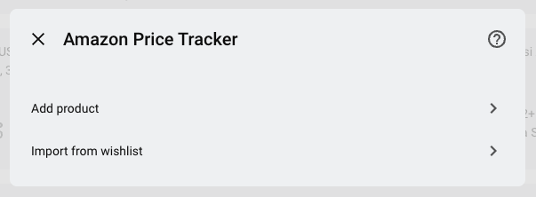
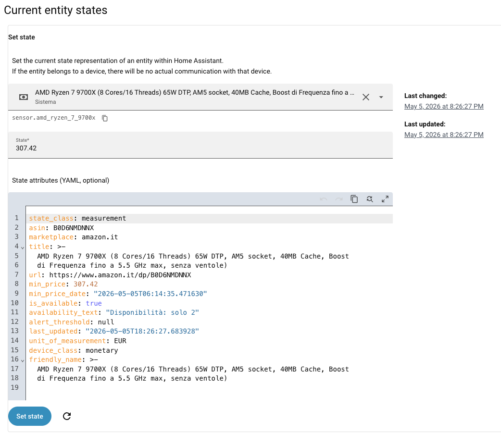
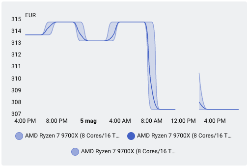

# Amazon Price Tracker for Home Assistant



[](https://github.com/hacs/default)
[](https://www.home-assistant.io/)
[](https://github.com/nuggetz/ha-amazon-price-tracker/releases)
[](LICENSE)
[](https://github.com/nuggetz/ha-amazon-price-tracker/stargazers)

[](https://my.home-assistant.io/redirect/hacs_repository/?owner=nuggetz&repository=ha-amazon-price-tracker&category=integration)

Track Amazon product prices directly in Home Assistant — no PA-API or third-party account required.

Each product is exposed as a sensor whose state is the current price. Price history is stored natively by the HA Recorder, so you get built-in graphs for free. Alerts are handled by standard HA automations.

---

## Features

- **20 Amazon marketplaces**: IT, DE, FR, ES, NL, BE, PL, SE, UK, IE, US, CA, JP, AU, BR, MX, IN, TR, AE, SG — each with the correct currency and language
- **Auto-detected default marketplace**: the marketplace dropdown pre-selects the one matching your Home Assistant country setting — no manual change needed for non-Italian installs
- Scrapes product pages without an Amazon account (JSON-LD first, CSS selectors as fallback)
- One sensor per product, added via UI Config Flow — edit name and alert threshold at any time via Options Flow
- Tracks historical minimum price, persisted across HA restarts
- Real-time stock status: `is_available` bool + `availability_text` from Amazon (e.g. "Only 2 left in stock")
- `amazon_price_tracker.force_refresh` service for on-demand price updates
- Polite by design: one shared browsing session per marketplace, spaced-out requests, randomised polling (~4 h ± 30 min), and an automatic pause when Amazon pushes back
- No external database, no Amazon account needed

---

## Supported marketplaces

| Marketplace | Currency |
| ----------- | -------- |
| amazon.it | EUR |
| amazon.de | EUR |
| amazon.fr | EUR |
| amazon.es | EUR |
| amazon.nl | EUR |
| amazon.be | EUR |
| amazon.pl | PLN |
| amazon.se | SEK |
| amazon.co.uk | GBP |
| amazon.ie | EUR |
| amazon.com | USD |
| amazon.ca | CAD |
| amazon.co.jp | JPY |
| amazon.com.au | AUD |
| amazon.com.br | BRL |
| amazon.com.mx | MXN |
| amazon.in | INR |
| amazon.com.tr | TRY |
| amazon.ae | AED |
| amazon.sg | SGD |

---

## Installation

### HACS (recommended)

**Amazon Price Tracker is now part of the default HACS store** — no custom repository needed.

1. Open HACS → search for **Amazon Price Tracker**
2. Click **Download** and restart Home Assistant

Or use the one-click button:

[](https://my.home-assistant.io/redirect/hacs_repository/?owner=nuggetz&repository=ha-amazon-price-tracker&category=integration)

### Manual

1. Copy `custom_components/amazon_price_tracker/` into your HA `config/custom_components/` folder
2. Restart Home Assistant

---

## Configuration

Go to **Settings → Integrations → Add integration → Amazon Price Tracker**.

When adding the integration you can choose between two modes:

- **Add product** — add a single product by ASIN
- **Import from wishlist** — import all products from a public Amazon wishlist at once



### Add product

| Field | Required | Description |
| ----- | -------- | ----------- |
| ASIN | Yes | 10-character Amazon product code (e.g. `B09FKN79QR`) |
| Custom name | Yes | Label shown in Home Assistant (e.g. `Kingston 32GB DDR5`) |
| Amazon marketplace | Yes | Which Amazon site to track — pre-selected automatically from your HA country setting |
| Price alert threshold | No | Used in automations to trigger below a target price |

> **Finding the ASIN:** open the product page on Amazon. The ASIN is in the URL after `/dp/` (e.g. `amazon.de/dp/B09FKN79QR`) or in the product details section near the bottom of the page. For products with variants (colour, size, storage…), select the exact variant first, then copy the URL.

### Import from wishlist

| Field | Required | Description |
| ----- | -------- | ----------- |
| Wishlist URL | Yes | Full URL of a **public** Amazon wishlist |
| Price alert threshold | No | Applied to all imported products (editable per-product later) |

The wishlist must be set to **Public** on Amazon (Account → Lists → Manage list → Privacy: Public). Only the first page (~40 products) is scraped.

To **edit** the name or alert threshold of an existing product, go to the integration panel and click **Configure** — no need to remove and re-add.

---

## Sensor

Each product creates one sensor entity under a dedicated device.

| Attribute | Type | Description |
| --------- | ---- | ----------- |
| `state` | `float` | Current price in the marketplace currency |
| `asin` | `str` | Amazon ASIN |
| `marketplace` | `str` | Marketplace being tracked (e.g. `amazon.de`) |
| `title` | `str` | Product title from Amazon |
| `url` | `str` | Link to the product page |
| `min_price` | `float` | Lowest price ever recorded (survives HA restarts) |
| `min_price_date` | `str ISO` | Date the minimum was recorded |
| `is_available` | `bool` | `false` when the product is out of stock |
| `availability_text` | `str` | Raw stock message from Amazon (e.g. "Only 2 left in stock") |
| `alert_threshold` | `float` or `null` | Threshold configured by the user |
| `last_updated` | `str ISO` | Timestamp of the last successful fetch |



---

## How it works, and why updates sometimes pause

Worth two minutes, because it explains almost every surprise you might hit.

**There is no Amazon API here.** No key, no account, no affiliate program. The
integration opens the same public product page your browser would and reads the
price off it. That is what makes it work without any setup — and it is also the
whole source of its one real limitation.

**Amazon watches for automated reading, and it watches per IP address.** When it
decides a request doesn't look like a person browsing, it doesn't return an
error. It returns a normal-looking page — a CAPTCHA, or a "Click the button below
to continue shopping" screen — with no price on it. Every tracked product on that
marketplace is affected at once, because they all come from your one address.

**So the integration tries hard to look like one person, not twenty robots.**
All your products on a marketplace share a single browsing session: one set of
cookies, warmed up by loading the homepage first, exactly as a browser does before
you click a product. Requests go out one at a time with a randomised 8–15 second
gap, so ten products never arrive as a simultaneous burst. And if Amazon pushes
back anyway, everything on that marketplace goes quiet for about half an hour
rather than the other products queueing up to collect a block each.

### What you'll actually notice

- **A product you just added shows `unavailable` for a moment.** Normal — the
  first price fetch runs in the background, and with several products the last
  one can take a couple of minutes.
- **Sensors occasionally go `unavailable` and come back on their own.** That's the
  pause doing its job. No action needed.
- **Prices update roughly every four hours, never on a fixed clock.** Deliberate.
- **A sensor sits at `unknown` while the product page is perfectly fine.** Amazon
  is showing that listing without a price — the "price higher than typical"
  notice, or no eligible seller — and offering only a *See all buying options*
  button. There is no price on the page to read, so the sensor reports none and
  `is_available` goes `false` until one comes back. It deliberately does not fall
  back to a price from elsewhere on the page: those belong to the alternative
  products Amazon suggests, not to yours.

### If it stays blocked

That's Amazon's decision about your IP address, and no amount of parsing on this
side can override it — if the request never reaches the product page, there is
nothing to read. What actually helps:

- **Wait.** Home broadband addresses usually get temporary challenges that clear
  by themselves within hours or days.
- **Track fewer products.** Each one is still its own request.
- **Check what your connection goes out through.** VPN exit nodes and
  datacenter/hosting IPs are flagged far harder than home connections, and often
  stay flagged. On a shared address you also inherit what everyone else on it has
  been doing.

To see where you stand, open the product URL in a private browser window on the
same network. If you get the "Continue shopping" page there too, the block is at
IP level and waiting is the answer.

---

## Services

### `amazon_price_tracker.import_wishlist`

Import all products from a **public** Amazon wishlist in one shot. One sensor is created per product; products already configured are skipped.

> The wishlist must be set to **Public** on Amazon (Account → Lists → Manage list → Privacy: Public).

```yaml
service: amazon_price_tracker.import_wishlist
data:
  url: "https://www.amazon.it/hz/wishlist/ls/XXXXXXXXXXXXXXXX"
  # marketplace: "amazon.it"     # optional, auto-detected from URL
  # alert_threshold: 150.00      # optional, applied to all imported products
```

Only the first page of the wishlist is scraped (~40 products). For longer lists, call the service multiple times with paginated URLs or split the wishlist.

---

### `amazon_price_tracker.force_refresh`

Immediately fetch the latest price without waiting for the next scheduled poll.

**Refresh all tracked products:**

```yaml
service: amazon_price_tracker.force_refresh
```

**Refresh a specific product:**

```yaml
service: amazon_price_tracker.force_refresh
target:
  entity_id: sensor.kingston_32gb_ddr5
```

---

## Price history graph

```yaml
type: history-graph
entities:
  - entity: sensor.kingston_32gb_ddr5
title: Price trend
hours_to_show: 720  # 30 days
```

Or with [mini-graph-card](https://github.com/kalkih/mini-graph-card) (HACS):

```yaml
type: custom:mini-graph-card
entities:
  - sensor.kingston_32gb_ddr5
hours_to_show: 720
```



---

## Price alert automations

### One product

```yaml
alias: "RAM price drop alert"
trigger:
  - platform: numeric_state
    entity_id: sensor.kingston_32gb_ddr5
    below: "{{ state_attr('sensor.kingston_32gb_ddr5', 'alert_threshold') }}"
action:
  - service: notify.mobile_app
    data:
      title: "Price drop!"
      message: >
        {{ state_attr('sensor.kingston_32gb_ddr5', 'title') }}
        dropped to {{ states('sensor.kingston_32gb_ddr5') }}
        (threshold: {{ state_attr('sensor.kingston_32gb_ddr5', 'alert_threshold') }})
```

### Every product, with a single automation

The integration fires an `amazon_price_tracker_price_drop` event whenever a
product's price crosses its own threshold downwards. One trigger covers every
product, including the ones you add later.

```yaml
alias: "Amazon price drop — all products"
mode: queued
max: 10

triggers:
  - trigger: event
    event_type: amazon_price_tracker_price_drop

actions:
  - action: notify.mobile_app_your_phone
    data:
      title: "Price drop"
      message: >
        {{ trigger.event.data.title }} is now
        {{ trigger.event.data.price }} {{ trigger.event.data.currency }}
        (threshold: {{ trigger.event.data.alert_threshold }})
      data:
        url: "{{ trigger.event.data.url }}"
```

Event data:

| Field | Description |
|---|---|
| `entity_id` | The sensor that dropped |
| `asin` | Product ASIN |
| `name` | Name you gave the product in Home Assistant |
| `title` | Product title as read from Amazon |
| `price` | The new price |
| `currency` | Marketplace currency (`EUR`, `USD`, `GBP`…) |
| `alert_threshold` | The threshold that was crossed |
| `min_price` | Lowest price ever recorded for this product |
| `url` | Product URL |
| `marketplace` | e.g. `amazon.it` |

- Each product keeps its own target: the threshold is set when adding the product
  and editable later from **Settings → Devices & Services → Amazon Price Tracker
  → Configure**. Products with no threshold set never fire.
- The event is the *crossing*, not the condition: it fires once when the price
  goes under the threshold, not on every refresh while it stays there. It re-arms
  when the price goes back above, or when the product stops having a price at all.
- Thresholds are always in the marketplace's own currency. Nothing is converted.

> **If you are on 0.4.1 or earlier**, this README documented an automation that
> triggered on `state_changed` and filtered by integration in the condition.
> That trigger fires for every state change in the whole instance and queues a
> run for each one, so the run that actually mattered was dropped once the queue
> filled — see [#9](https://github.com/nuggetz/ha-amazon-price-tracker/issues/9).
> Replace it with the automation above.

---

## Technical notes

- Default marketplace is auto-detected from `hass.config.country` (ISO 3166-1 alpha-2); falls back to `amazon.it` if unset
- Polling every ~4 hours with ±30 min jitter
- **One shared session per marketplace**, not per product: a single cookie jar and connection pool, warmed up from the homepage, so tracked products look like one visitor browsing rather than N unrelated ones
- Requests to the same marketplace are serialised and spaced 8–15s apart, so products never arrive as a synchronised burst
- A block pauses every product on that marketplace for ~30 min (circuit breaker) instead of each one collecting its own
- Direct HTML scraping: JSON-LD structured data first, CSS selectors as fallback, composite whole+fraction as last resort
- Fires `amazon_price_tracker_price_drop` on a threshold crossing, so one automation can cover every product without listening to the whole event bus
- `min_price` uses `RestoreSensor` — survives HA restarts without an external DB
- HTTP client: `httpx` async (not `aiohttp`, to avoid version conflicts with HA internals)
- HTML parsing runs in an executor thread (non-blocking)
- Each marketplace uses the correct `Accept-Language` header and decimal format

---

## Troubleshooting

### `Amazon blocked amazon.xx — pausing every product on this marketplace for N minutes`

Amazon answered with an anti-bot page instead of a product listing. Every product
on that marketplace pauses for about 30 minutes and then recovers on its own —
nothing to do, and nothing is broken. See
[How it works](#how-it-works-and-why-updates-sometimes-pause) for why the pause is
deliberate and what to try if it keeps happening.

### A newly added product stays `unavailable` for a while

Expected — the first fetch runs in the background and requests are spaced out, so
with several products the last one can take a couple of minutes to populate.
Setup is deliberately never failed when Amazon is blocking, because that would
hand control to Home Assistant's setup-retry ladder, which retries far more
aggressively than the integration's own backoff.

### `Could not parse price for ASIN … on what looks like a real product page`

Amazon served a genuine listing but none of the price strategies matched — most
likely a layout change on that marketplace. Enable debug logging (below), wait
for the next refresh, and [open an issue](https://github.com/nuggetz/ha-amazon-price-tracker/issues)
with the captured page; that log line contains the full HTML the parser saw.

---

## Debug logging

Add to your `configuration.yaml`:

```yaml
logger:
  default: warning
  logs:
    custom_components.amazon_price_tracker: debug
```

---

## Roadmap

- [x] Options Flow (edit name and threshold without removing the entry)
- [x] `amazon_price_tracker.force_refresh` service call
- [x] Multi-domain support (20 Amazon marketplaces)
- [x] Real-time availability text
- [x] Wishlist import — from Config Flow UI and from Developer Tools service
- [x] Accepted into the default HACS store 🎉
- [x] Shared session per marketplace, request spacing and circuit breaker
- [ ] Proxy support for blocked IPs
- [ ] Product image as `entity_picture` attribute

---

## License

MIT — see [LICENSE](LICENSE).
